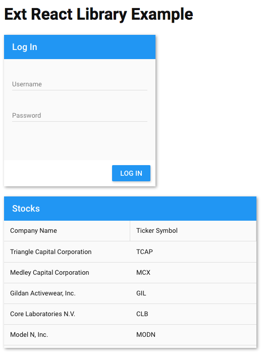

# ExtReact Library Example

This example project shows how to create a library of React components based on ExtReact.  This project is a lerna monorepo containing two packages:

* my-lib - A library of React components built with ExtReact.
* my-app - An app that uses my-lib.  Note that my-lib does not list ext-react or any related Sencha packages as dependencies.

## Environment Setup

This project requires a valid license or trial of Sencha ExtReact.  If you have not already, run the following to sign into Sencha's npm registry:

```
npm login --registry=https://npm.sencha.com --scope=@extjs
```

## Running

```
npm install
npm start
```

## Screenshot



